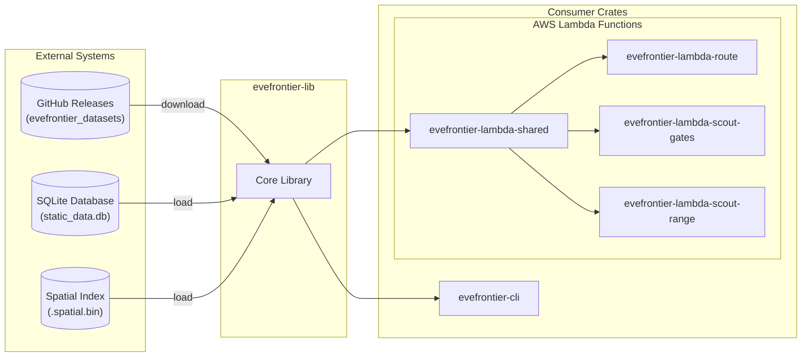
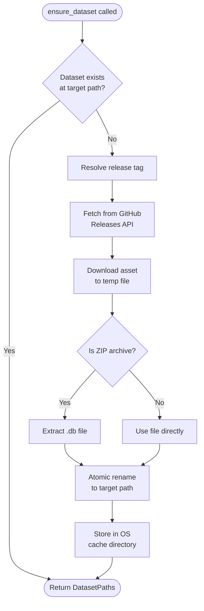
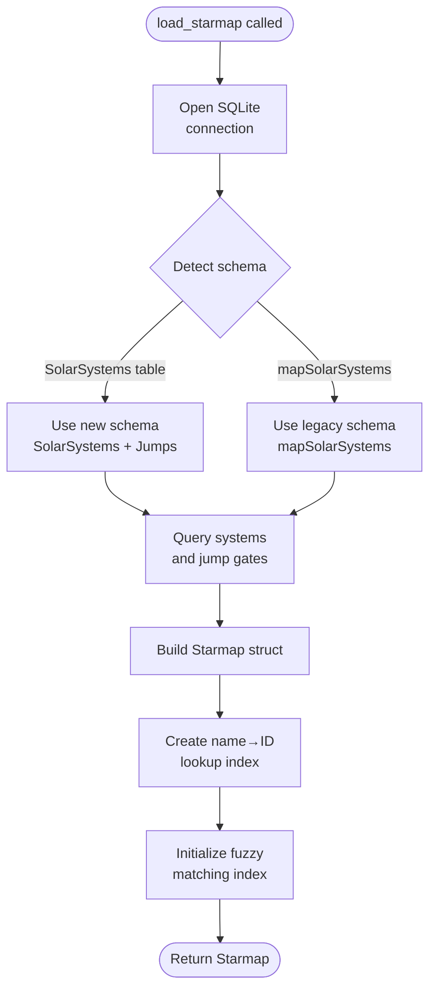
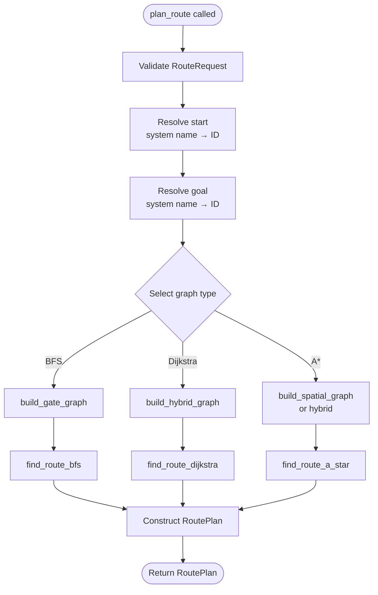
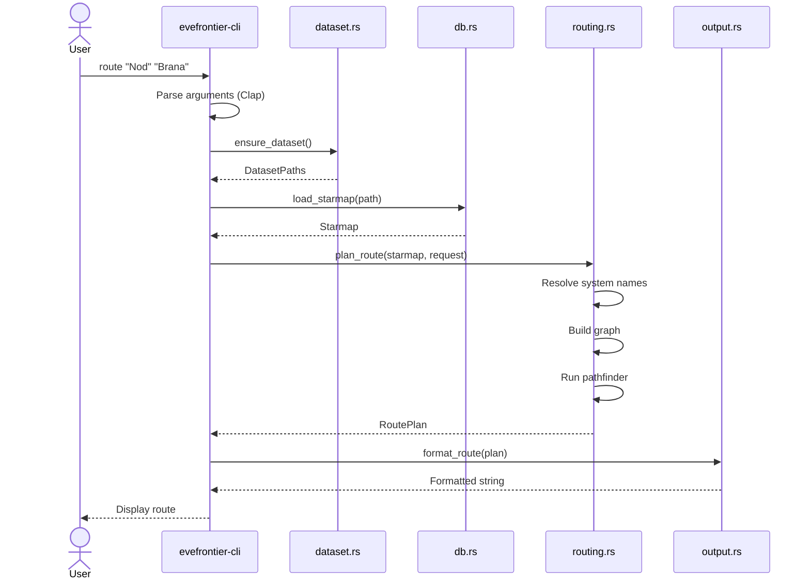
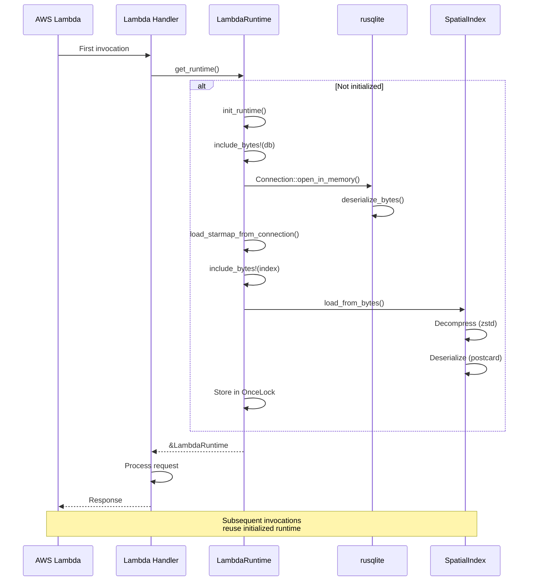

# EVE Frontier Architecture

This document provides visual documentation of the EVE Frontier Rust workspace architecture,
including component relationships, data flows, and key operational sequences.

All diagrams use [Mermaid](https://mermaid.js.org/) syntax and render natively in GitHub and VS
Code.

## Table of Contents

- [EVE Frontier Architecture](#eve-frontier-architecture)
  - [Table of Contents](#table-of-contents)
  - [Component Overview](#component-overview)
    - [Component Descriptions](#component-descriptions)
  - [Module Dependencies](#module-dependencies)
    - [Module Responsibilities](#module-responsibilities)
  - [Data Flows](#data-flows)
    - [Dataset Download Flow](#dataset-download-flow)
    - [Starmap Load Flow](#starmap-load-flow)
    - [Route Planning Flow](#route-planning-flow)
  - [Sequence Diagrams](#sequence-diagrams)
    - [CLI Route Command](#cli-route-command)
    - [Lambda Cold-Start](#lambda-cold-start)
  - [See Also](#see-also)

---

## Component Overview

High-level view of the Rust workspace crates and their relationships with external systems.



### Component Descriptions

| Component                        | Type    | Description                                                                             |
| -------------------------------- | ------- | --------------------------------------------------------------------------------------- |
| `evefrontier-lib`                | Library | Core business logic: dataset handling, graph construction, routing algorithms           |
| `evefrontier-cli`                | Binary  | Command-line interface with Clap argument parsing and output formatting                 |
| `evefrontier-lambda-shared`      | Library | Shared Lambda infrastructure: tracing, RFC 9457 problem details, runtime initialization |
| `evefrontier-lambda-route`       | Binary  | Lambda handler for route planning endpoint                                              |
| `evefrontier-lambda-scout-gates` | Binary  | Lambda handler for gate-connected neighbors query                                       |
| `evefrontier-lambda-scout-range` | Binary  | Lambda handler for spatial range queries                                                |

---

## Module Dependencies

Internal module structure of `evefrontier-lib` showing how modules depend on each other.

```mermaid
graph TD
    subgraph "evefrontier-lib"
        error[error.rs<br/>Error types]

        github[github.rs<br/>GitHub downloader]
        dataset[dataset.rs<br/>Path resolution]
        db[db.rs<br/>SQLite loader]

        spatial[spatial.rs<br/>KD-tree index]
        graph[graph.rs<br/>Graph builders]
        path[path.rs<br/>Pathfinding]
        routing[routing.rs<br/>Route planning]

        output[output.rs<br/>Formatting]
        temperature[temperature.rs<br/>Temp calculations]
    end

    github --> dataset
    dataset --> db
    db --> graph
    graph --> path
    path --> routing

    spatial --> graph
    spatial --> routing

    temperature --> graph
    temperature --> routing

    error --> github
    error --> dataset
    error --> db
    error --> routing

    routing --> output
```

### Module Responsibilities

| Module           | Responsibility                         | Key Exports                                                     |
| ---------------- | -------------------------------------- | --------------------------------------------------------------- |
| `error.rs`       | Centralized error handling             | `Error`, `Result`                                               |
| `github.rs`      | Download datasets from GitHub releases | `download_dataset_with_tag`, `DatasetRelease`                   |
| `dataset.rs`     | Resolve and ensure dataset paths       | `ensure_dataset`, `ensure_e6c3_dataset`, `DatasetPaths`         |
| `db.rs`          | Load SQLite into Starmap               | `load_starmap`, `load_starmap_from_connection`, `Starmap`       |
| `graph.rs`       | Build adjacency graphs                 | `build_gate_graph`, `build_spatial_graph`, `build_hybrid_graph` |
| `path.rs`        | Pathfinding algorithms                 | `find_route_bfs`, `find_route_dijkstra`, `find_route_a_star`    |
| `routing.rs`     | High-level route planning              | `plan_route`, `RouteRequest`, `RoutePlan`                       |
| `spatial.rs`     | KD-tree spatial index                  | `SpatialIndex`, `SpatialIndex::build`, `try_load_spatial_index` |
| `output.rs`      | Output formatting                      | `RouteSummary`, `RouteStep`, `RouteOutputKind`                  |
| `temperature.rs` | Temperature constraint helpers         | Temperature filtering predicates                                |

---

## Data Flows

### Dataset Download Flow

How the system ensures dataset availability, with caching and atomic writes.



### Starmap Load Flow

How SQLite data transforms into the in-memory Starmap with schema detection.



### Route Planning Flow

How a route request transforms into a computed path.



---

## Sequence Diagrams

### CLI Route Command

Time-ordered sequence of a user running `evefrontier-cli route "Nod" "Brana"`.



### Lambda Cold-Start

Time-ordered sequence of Lambda initialization with bundled data.



---

## See Also

- **[Usage Guide](USAGE.md)** - CLI commands, library API examples, Lambda invocation
- **[Deployment Guide](DEPLOYMENT.md)** - AWS Lambda deployment with Terraform
- **[ADR 0002: Workspace Structure](adrs/0002-workspace-structure.md)** - Library + CLI architecture
  decision
- **[ADR 0006: Software Components](adrs/0006-software-components.md)** - Toolchain and component
  documentation
- **[ADR 0009: KD-tree Spatial Index](adrs/0009-kd-tree-spatial-index.md)** - Spatial index design
- **[README](../README.md)** - Project overview and quick start

---

_Last updated: 2025-12-29_
