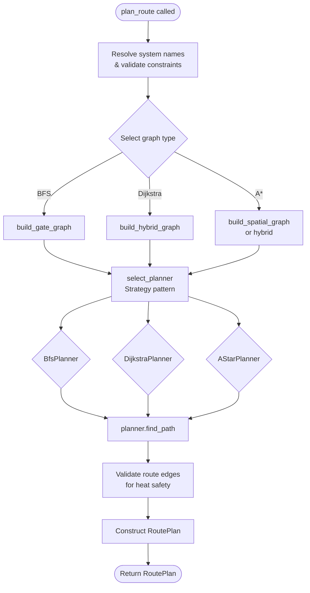

# EVE Frontier Architecture

This document provides visual documentation of the EVE Frontier Rust workspace architecture,
including component relationships, data flows, and key operational sequences.

All diagrams use [Mermaid](https://mermaid.js.org/) syntax and render natively in GitHub and VS
Code.

## Table of Contents

- [EVE Frontier Architecture](#eve-frontier-architecture)
  - [Table of Contents](#table-of-contents)
  - [Design Patterns](#design-patterns)
    - [Strategy Pattern (Routing Algorithms)](#strategy-pattern-routing-algorithms)
    - [Predicate Functions (Edge Filtering)](#predicate-functions-edge-filtering)
    - [Module Organization (Single Responsibility)](#module-organization-single-responsibility)
  - [Component Overview](#component-overview)
    - [Component Descriptions](#component-descriptions)
  - [Module Dependencies](#module-dependencies)
    - [Module Responsibilities](#module-responsibilities)
  - [Data Flows](#data-flows)
    - [Dataset Download Flow](#dataset-download-flow)
    - [Starmap Load Flow](#starmap-load-flow)
    - [Route Planning Flow](#route-planning-flow)
  - [Sequence Diagrams](#sequence-diagrams)
    - [CLI Route Command](#cli-route-command)
    - [Lambda Cold-Start](#lambda-cold-start)
  - [See Also](#see-also)

---

## Design Patterns

The codebase employs several design patterns to maintain SOLID principles and clean architecture:

### Strategy Pattern (Routing Algorithms)

The `routing/planner.rs` module implements the Strategy pattern for algorithm selection:

```rust
pub trait RoutePlanner: Send + Sync {
    fn algorithm(&self) -> RouteAlgorithm;
    fn find_path(&self, graph: &Graph, starmap: Option<&Starmap>,
                 start: SystemId, goal: SystemId,
                 constraints: &SearchConstraints) -> Option<Vec<SystemId>>;
    fn requires_spatial_index(&self) -> bool { false }
}
```

Three implementations (`BfsPlanner`, `DijkstraPlanner`, `AStarPlanner`) encapsulate algorithm-specific
logic. The `select_planner()` factory function returns the appropriate planner based on the request.

**Benefits:**
- **Open/Closed Principle**: New algorithms can be added without modifying `plan_route()`
- **Single Responsibility**: Each planner handles only its algorithm
- **Testability**: Planners can be unit tested in isolation

### Predicate Functions (Edge Filtering)

The `path.rs` module uses composable predicate functions for edge filtering:

```rust
fn edge_meets_distance_limit(edge: &Edge, max_jump: Option<f64>) -> bool;
fn edge_meets_gate_policy(edge: &Edge, avoid_gates: bool) -> bool;
fn system_meets_avoidance(target: SystemId, avoided: &HashSet<SystemId>) -> bool;
fn system_meets_temperature(edge: &Edge, starmap: Option<&Starmap>,
                            target: SystemId, max_temperature: Option<f64>) -> bool;
fn hop_meets_heat_safety(edge: &Edge, target: SystemId, ctx: &HeatSafetyContext) -> bool;
```

**Benefits:**
- **Composability**: Predicates combine cleanly in `PathConstraints::allows()`
- **Testability**: Each predicate can be unit tested independently
- **Extensibility**: New constraints can be added as new predicates

### Module Organization (Single Responsibility)

Large modules are split into focused submodules:

- **`ship/`**: `attributes.rs`, `fuel.rs`, `heat.rs`, `catalog.rs`, `constants.rs`
- **`routing/`**: `mod.rs` (orchestration), `planner.rs` (algorithms)

---

## Component Overview

High-level view of the Rust workspace crates and their relationships with external systems.


### Component Descriptions

| Component                        | Type    | Description                                                                             |
| -------------------------------- | ------- | --------------------------------------------------------------------------------------- |
| `evefrontier-lib`                | Library | Core business logic: dataset handling, graph construction, routing algorithms           |
| `evefrontier-cli`                | Binary  | Command-line interface with Clap argument parsing and output formatting                 |
| `evefrontier-lambda-shared`      | Library | Shared Lambda infrastructure: tracing, RFC 9457 problem details, runtime initialization |
| `evefrontier-lambda-route`       | Binary  | Lambda handler for route planning endpoint                                              |
| `evefrontier-lambda-scout-gates` | Binary  | Lambda handler for gate-connected neighbors query                                       |
| `evefrontier-lambda-scout-range` | Binary  | Lambda handler for spatial range queries                                                |

---

## Module Dependencies

Internal module structure of `evefrontier-lib` showing how modules depend on each other.

```mermaid
graph TD
    subgraph "evefrontier-lib"
        error[error.rs<br/>Error types]

        github[github.rs<br/>GitHub downloader]
        dataset[dataset.rs<br/>Path resolution]
        db[db.rs<br/>SQLite loader]

        spatial[spatial.rs<br/>KD-tree index]
        graph[graph.rs<br/>Graph builders]
        path[path.rs<br/>Pathfinding + Predicates]

        subgraph routing["routing/"]
            routing_mod[mod.rs<br/>Route orchestration]
            planner[planner.rs<br/>Strategy pattern]
        end

        subgraph ship["ship/"]
            ship_mod[mod.rs<br/>Re-exports]
            attributes[attributes.rs<br/>ShipAttributes]
            fuel[fuel.rs<br/>Fuel calculations]
            heat[heat.rs<br/>Heat calculations]
            catalog[catalog.rs<br/>Ship catalog]
        end

        output[output.rs<br/>Formatting]
        temperature[temperature.rs<br/>Temp calculations]
    end

    dataset --> github
    dataset --> db
    db --> graph
    graph --> path
    path --> routing_mod
    planner --> path

    spatial --> graph
    spatial --> routing_mod

    temperature --> graph
    temperature --> routing_mod

    error --> github
    error --> dataset
    error --> db
    error --> routing_mod

    routing_mod --> output
    routing_mod --> planner

    ship_mod --> fuel
    ship_mod --> heat
    ship_mod --> attributes
    ship_mod --> catalog
    fuel --> path
    heat --> path
```

### Module Responsibilities

| Module               | Responsibility                               | Key Exports                                                     |
| -------------------- | -------------------------------------------- | --------------------------------------------------------------- |
| `error.rs`           | Centralized error handling                   | `Error`, `Result`                                               |
| `github.rs`          | Download datasets from GitHub releases       | `download_dataset_with_tag`, `DatasetRelease`                   |
| `dataset.rs`         | Resolve and ensure dataset paths             | `ensure_dataset`, `ensure_e6c3_dataset`, `DatasetPaths`         |
| `db.rs`              | Load SQLite into Starmap                     | `load_starmap`, `load_starmap_from_connection`, `Starmap`       |
| `graph.rs`           | Build adjacency graphs                       | `build_gate_graph`, `build_spatial_graph`, `build_hybrid_graph` |
| `path.rs`            | Pathfinding algorithms + edge predicates     | `find_route_bfs`, `find_route_dijkstra`, `PathConstraints`      |
| `routing/mod.rs`     | High-level route orchestration               | `plan_route`, `RouteRequest`, `RoutePlan`                       |
| `routing/planner.rs` | Strategy pattern for algorithm selection     | `RoutePlanner` trait, `BfsPlanner`, `DijkstraPlanner`, `AStarPlanner` |
| `ship/mod.rs`        | Ship attributes and calculations             | `ShipAttributes`, `ShipLoadout`, `ShipCatalog`                  |
| `ship/fuel.rs`       | Fuel consumption calculations                | `calculate_jump_fuel_cost`, `calculate_route_fuel`              |
| `ship/heat.rs`       | Heat generation calculations                 | `calculate_jump_heat`, `HeatConfig`                             |
| `spatial.rs`         | KD-tree spatial index                        | `SpatialIndex`, `SpatialIndex::build`, `try_load_spatial_index` |
| `output.rs`          | Output formatting                            | `RouteSummary`, `RouteStep`, `RouteOutputKind`                  |
| `temperature.rs`     | Temperature constraint helpers               | Temperature filtering predicates                                |

---

## Data Flows

### Dataset Download Flow

How the system ensures dataset availability, with caching and atomic writes.


### Starmap Load Flow

How SQLite data transforms into the in-memory Starmap with schema detection.

```mermaid
flowchart TD
    START([load_starmap called]) --> OPEN[Open SQLite<br/>connection]

    OPEN --> DETECT{Detect schema}
    DETECT -->|SolarSystems table| NEW[Use new schema<br/>SolarSystems + Jumps]
    DETECT -->|mapSolarSystems| LEGACY[Use legacy schema<br/>mapSolarSystems]

    NEW --> QUERY[Query systems<br/>and jump gates]
    LEGACY --> QUERY

    QUERY --> BUILD[Build Starmap struct]
    BUILD --> INDEX[Create name→ID<br/>lookup index]
    INDEX --> FUZZY[Initialize fuzzy<br/>matching index]

    FUZZY --> RETURN([Return Starmap])
```



### Route Planning Flow

How a route request transforms into a computed path using the Strategy pattern.



---

## Sequence Diagrams

### CLI Route Command

Time-ordered sequence of a user running `evefrontier-cli route "Nod" "Brana"`.


### Lambda Cold-Start

Time-ordered sequence of Lambda initialization with bundled data.


---

## See Also

- **[Usage Guide](USAGE.md)** - CLI commands, library API examples, Lambda invocation
- **[Deployment Guide](DEPLOYMENT.md)** - AWS Lambda deployment with Terraform
- **[ADR 0002: Workspace Structure](adrs/0002-workspace-structure.md)** - Library + CLI architecture
  decision
- **[ADR 0006: Software Components](adrs/0006-software-components.md)** - Toolchain and component
  documentation
- **[ADR 0009: KD-tree Spatial Index](adrs/0009-kd-tree-spatial-index.md)** - Spatial index design
- **[README](../README.md)** - Project overview and quick start

---

_Last updated: 2025-01-12_
