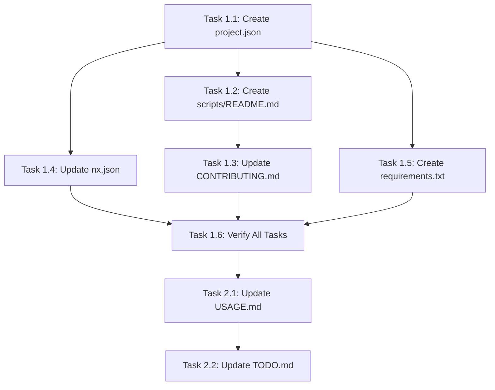

# Implementation Plan: Automation Scripts & Nx Task Integration

**Feature**: 002-automation-scripts-nx-tasks  
**Created**: 2025-12-27  
**Status**: Planning Complete

---

## Technical Context

### Current State Assessment

| Area | Status | Notes |
|------|--------|-------|
| Scripts Directory | EXISTS | 12 scripts (6 Python, 6 Node.js) |
| Nx Workspace | CONFIGURED | 7 projects (6 Rust crates + root) |
| Scripts Nx Project | MISSING | No `scripts/project.json` exists |
| Script Documentation | PARTIAL | Some inline docstrings, no unified README |
| Python Version | ✅ VERIFIED | 3.13.5 available at `/usr/bin/python3` |
| .gitignore venv | ✅ VERIFIED | `scripts/.venv/` already configured |

### Existing Scripts Inventory

| Script | Language | Current Usage | Nx Integration | Status |
|--------|----------|---------------|----------------|--------|
| `fixture_status.py` | Python | Direct execution | NEEDS TASK | ✅ Ready |
| `extract_fixture_from_dataset.py` | Python | Direct execution | NEEDS TASK | ✅ Ready |
| `inspect_db.py` | Python | Direct execution | NEEDS TASK | ⚠️ Bug: crashes on modern schema |
| `create_minimal_db.py` | Python | Direct execution | NEEDS TASK | ✅ Ready |
| `analyze_sample_routes.py` | Python | Direct execution | NEEDS TASK | ✅ Ready (hardcoded paths) |
| `extract_route_fixture.py` | Python | Direct execution | NEEDS TASK | ✅ Ready |
| `run-audit.js` | Node.js | Via Nx run-commands | ALREADY INTEGRATED | - |
| `outdated-report.js` | Node.js | Via package.json | ALREADY INTEGRATED | - |
| `check-pnpm-outdated.js` | Node.js | Via package.json | ALREADY INTEGRATED | - |
| `run-markdownlint-if-exists.js` | Node.js | Via package.json | ALREADY INTEGRATED | - |
| `run-precommit-nx.js` | Node.js | Via husky | ALREADY INTEGRATED | - |
| `run-prettier-if-exists.js` | Node.js | Via package.json | ALREADY INTEGRATED | - |

### Existing Tag Patterns (from analysis)

| Project Type | Tags Used |
|--------------|-----------|
| Library | `type:library, lang:rust` |
| Application | `type:application, lang:rust` |
| Lambda | `type:application, lang:rust, scope:lambda` |
| **Scripts (proposed)** | `type:tooling, lang:mixed, scope:scripts` |

### Technology Choices

- **Task Runner**: Nx `nx:run-commands` executor
- **Python**: 3.10+ with venv (managed via requirements.txt)
- **Node.js**: 20+ (per .nvmrc)
- **Venv Location**: `scripts/.venv/` (gitignored)

---

## Constitution Check

| Principle | Status | Implementation |
|-----------|--------|----------------|
| Security-first | ✅ COMPLIANT | Scripts use parameterized queries, no shell injection |
| Small focused changes | ✅ COMPLIANT | Adding project.json + docs only |
| Nx orchestration | ✅ ALIGNS with ADR 0006 | Scripts exposed as Nx tasks |
| Boyd Loop development | ✅ FOLLOWED | Observe→Orient→Decide→Act pattern |

---

## Gate Evaluation

### Pre-Implementation Gates

| Gate | Status | Evidence |
|------|--------|----------|
| ADR review | ✅ PASSED | ADR 0006 (software components) requires Nx orchestration |
| Security review | ✅ PASSED | Scripts use safe patterns, no credential handling |
| Breaking changes | ✅ NONE | Adding new tasks, no modifications to existing |
| Environment check | ✅ PASSED | Python 3.13.5 available, .gitignore configured |
| Script testing | ✅ PASSED | All scripts tested, one bug identified (inspect_db.py) |

---

## Phase 0: Research (Complete)

### Research Tasks Completed

1. **Nx run-commands executor patterns**: Use `{args.param}` for argument forwarding
2. **Python script argument handling**: argparse with consistent patterns
3. **Caching strategy**: Based on input file hashes for deterministic tasks
4. **Project consistency analysis**: Tag patterns, schema paths verified
5. **Script functionality testing**: All 6 Python scripts tested

### Issues Identified

| Issue | Severity | Impact | Resolution |
|-------|----------|--------|------------|
| `inspect_db.py` crashes on modern schema | Medium | Script fails when `mapSolarSystems` table missing | Add try/except wrapper |

### Decisions Made

| Decision | Rationale | Alternatives Considered |
|----------|-----------|------------------------|
| Use `scripts/` as project root | Aligns with existing structure | `tools/`, `bin/` |
| Use venv with requirements.txt | Enables future dependencies, clean isolation | stdlib only |
| Separate tasks per script | Clear, focused task names | Single meta-task |
| Add `verify-all` meta-task | Runs all verification in one command | Manual task listing |
| CI-compatible fixture-sync | Enables automated fixture updates | Local-only execution |
| Add `scope:scripts` tag | Matches lambda project pattern | No scope tag |
| Schema path `../node_modules/...` | Scripts at root level, not in crates/ | `../../node_modules/...` |

---

## Phase 1: Implementation Tasks

### Task 1.1: Create Scripts Nx Project Configuration

**File**: `scripts/project.json`

```json
{
  "name": "scripts",
  "$schema": "../node_modules/nx/schemas/project-schema.json",
  "projectType": "application",
  "sourceRoot": "scripts",
  "tags": ["type:tooling", "lang:mixed", "scope:scripts"],
  "targets": {
    "fixture-verify": {
      "executor": "nx:run-commands",
      "options": {
        "command": "python3 scripts/fixture_status.py verify",
        "cwd": "{workspaceRoot}"
      },
      "inputs": [
        "{workspaceRoot}/docs/fixtures/minimal/static_data.db",
        "{workspaceRoot}/docs/fixtures/minimal_static_data.meta.json",
        "{workspaceRoot}/scripts/fixture_status.py"
      ],
      "cache": true
    },
    "fixture-status": {
      "executor": "nx:run-commands",
      "options": {
        "command": "python3 scripts/fixture_status.py status",
        "cwd": "{workspaceRoot}"
      },
      "cache": false
    },
    "fixture-record": {
      "executor": "nx:run-commands",
      "options": {
        "command": "python3 scripts/fixture_status.py record",
        "cwd": "{workspaceRoot}"
      },
      "outputs": [
        "{workspaceRoot}/docs/fixtures/minimal_static_data.meta.json"
      ],
      "cache": false
    },
    "fixture-sync": {
      "executor": "nx:run-commands",
      "options": {
        "command": "python3 scripts/extract_fixture_from_dataset.py {args.source} {args.target}",
        "cwd": "{workspaceRoot}"
      },
      "cache": false
    },
    "inspect-db": {
      "executor": "nx:run-commands",
      "options": {
        "command": "python3 scripts/inspect_db.py {args.path}",
        "cwd": "{workspaceRoot}"
      },
      "cache": false
    },
    "analyze-routes": {
      "executor": "nx:run-commands",
      "options": {
        "command": "python3 scripts/analyze_sample_routes.py {args.db} {args.csv}",
        "cwd": "{workspaceRoot}"
      },
      "cache": false
    },
    "route-fixture-extract": {
      "executor": "nx:run-commands",
      "options": {
        "command": "python3 scripts/extract_route_fixture.py",
        "cwd": "{workspaceRoot}"
      },
      "cache": false
    },
    "fixture-create": {
      "executor": "nx:run-commands",
      "options": {
        "command": "python3 scripts/create_minimal_db.py {args.source}",
        "cwd": "{workspaceRoot}"
      },
      "cache": false
    },
    "venv-setup": {
      "executor": "nx:run-commands",
      "options": {
        "commands": [
          "python3 -m venv scripts/.venv",
          "scripts/.venv/bin/pip install -r scripts/requirements.txt"
        ],
        "cwd": "{workspaceRoot}",
        "parallel": false
      },
      "cache": false
    },
    "verify-all": {
      "executor": "nx:run-commands",
      "dependsOn": ["fixture-verify"],
      "options": {
        "command": "echo 'All verification tasks passed'",
        "cwd": "{workspaceRoot}"
      },
      "cache": false
    }
  }
}
```

**Acceptance Criteria**:
- [ ] `pnpm nx show project scripts` displays all targets
- [ ] `pnpm nx run scripts:fixture-verify` executes successfully
- [ ] `pnpm nx run scripts:fixture-status` shows fixture info
- [ ] `pnpm nx run scripts:venv-setup` creates venv and installs deps
- [ ] `pnpm nx run scripts:verify-all` runs all verification tasks

---

### Task 1.2: Create Scripts README

**File**: `scripts/README.md`

Content outline:
- Purpose of scripts directory
- Available Nx tasks with examples
- Direct execution instructions
- Python version requirements

**Acceptance Criteria**:
- [ ] README documents all scripts
- [ ] Usage examples are correct and tested

---

### Task 1.3: Update CONTRIBUTING.md

Add section on developer scripts:
- How to run scripts via Nx
- When to use each script
- Python setup requirements

**Acceptance Criteria**:
- [ ] Developer workflow documented
- [ ] Links to scripts/README.md

---

### Task 1.4: Update nx.json (if needed)

Add scripts project to named inputs if caching optimization needed.

**Acceptance Criteria**:
- [ ] Nx recognizes scripts project
- [ ] Task caching works for fixture-verify

---

### Task 1.5: Create requirements.txt

**File**: `scripts/requirements.txt`

Initial contents (stdlib only, but ready for future deps):
```
# Python dependencies for evefrontier-rs scripts
# Currently using stdlib only, but ready for additions
```

**Acceptance Criteria**:
- [ ] File exists and is valid
- [ ] venv-setup task works with empty/minimal requirements

---

### Task 1.6: Verify All Script Tasks

Test each task:
1. `pnpm nx run scripts:venv-setup`
2. `pnpm nx run scripts:fixture-verify`
3. `pnpm nx run scripts:fixture-status`
4. `pnpm nx run scripts:fixture-record`
5. `pnpm nx run scripts:inspect-db -- --args.path=docs/fixtures/minimal/static_data.db`
6. `pnpm nx run scripts:verify-all`

**Acceptance Criteria**:
- [ ] All tasks execute without errors
- [ ] Tasks produce expected output
- [ ] Help/usage displayed for invalid args

---

## Phase 2: Documentation & Cleanup

### Task 2.1: Update docs/USAGE.md

Add "Developer Scripts" section explaining:
- Fixture management workflow
- Database inspection commands
- Route analysis tools

### Task 2.2: Update TODO.md

Mark task as complete with implementation notes.

---

## Implementation Order



---

## Verification Checklist

- [ ] All Python scripts work via `pnpm nx run scripts:<task>`
- [ ] `fixture-verify` correctly validates fixtures
- [ ] `venv-setup` creates virtual environment successfully
- [ ] `verify-all` meta-task runs all verification tasks
- [ ] Scripts README is complete and accurate
- [ ] CONTRIBUTING.md includes script documentation
- [ ] No breaking changes to existing functionality
- [ ] CHANGELOG.md updated with new capabilities
- [ ] Scripts work in CI environment (non-interactive)

---

## Risk Assessment

| Risk | Likelihood | Impact | Mitigation |
|------|------------|--------|------------|
| Python version mismatch | Low | Medium | Document Python 3.10+ requirement |
| Nx argument passing issues | Medium | Low | Test each task with args |
| Caching false positives | Low | Medium | Disable cache for mutating tasks |

---

## Estimated Effort

| Task | Time | Complexity |
|------|------|------------|
| 1.1 Create project.json | 20 min | Low |
| 1.2 Create README | 20 min | Low |
| 1.3 Update CONTRIBUTING | 10 min | Low |
| 1.4 Update nx.json | 5 min | Low |
| 1.5 Create requirements.txt | 5 min | Low |
| 1.6 Verify tasks | 25 min | Low |
| 2.1 Update USAGE.md | 15 min | Low |
| 2.2 Update TODO.md | 5 min | Low |
| **Total** | **~105 min** | **Low** |
