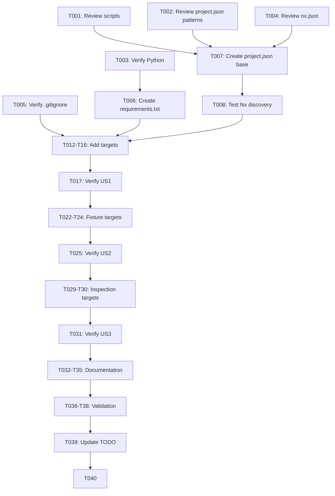

# Tasks: Automation Scripts & Nx Task Integration

**Input**: Design documents from `/specs/002-automation-scripts-nx-tasks/`
**Prerequisites**: plan.md (complete), spec.md (complete), research.md (complete)
**Tests**: Included - verification of Nx task execution and script functionality

**Organization**: Tasks grouped by user story for independent implementation and testing.

## Format: `[ID] [P?] [Story] Description`

- **[P]**: Can run in parallel (different files, no dependencies)
- **[Story]**: Which user story this task belongs to (US1=Nx Discovery, US2=Fixture Management, US3=DB Inspection)
- Include exact file paths in descriptions

---

## Phase 1: Setup (Shared Infrastructure)

**Purpose**: Prepare environment and understand existing scripts

- [X] T001 Review existing scripts in `scripts/` directory and document current functionality
- [X] T002 [P] Review existing `project.json` files in `crates/*/project.json` for Nx task patterns
- [X] T003 [P] Verify Python 3.10+ is available and document version requirement
- [X] T004 [P] Review `nx.json` to understand workspace configuration and caching patterns
- [X] T005 [P] Verify `scripts/.venv/` is in `.gitignore` for Python virtual environment

---

## Phase 2: Foundational (Blocking Prerequisites)

**Purpose**: Create base configuration files required by all user stories

**⚠️ CRITICAL**: These tasks must complete before user story implementation begins

- [X] T006 Create `scripts/requirements.txt` with comment header for future dependencies
  - File: `scripts/requirements.txt`
  - Content: Comment explaining stdlib-only for now, ready for additions

- [X] T007 Create base `scripts/project.json` with Nx project configuration
  - File: `scripts/project.json`
  - Include: name, $schema, projectType, sourceRoot, tags
  - Targets added in subsequent tasks

- [X] T008 [P] Test that Nx discovers the scripts project
  - Run: `pnpm nx show project scripts`
  - Verify: Project is listed with correct metadata

**Checkpoint**: Foundation ready - Nx project exists and is discoverable

---

## Phase 3: User Story 1 - Unified Script Discovery via Nx (Priority: P1) 🎯 MVP

**Goal**: Register all Python scripts as Nx tasks for unified discovery and execution

**Independent Test**: `pnpm nx show project scripts` lists all script tasks with correct names

### Tests for User Story 1

- [X] T009 [US1] Test Case: `pnpm nx show project scripts` → displays all targets
- [X] T010 [US1] Test Case: `pnpm nx run scripts:venv-setup` → creates venv successfully
- [X] T011 [US1] Test Case: `pnpm nx run scripts:verify-all` → runs all verification tasks

### Implementation for User Story 1

- [X] T012 [P] [US1] Add `venv-setup` target to `scripts/project.json`
  - Command: `python3 -m venv scripts/.venv && scripts/.venv/bin/pip install -r scripts/requirements.txt`
  - Cache: false (mutating operation)

- [X] T013 [P] [US1] Add `fixture-status` target to `scripts/project.json`
  - Command: `python3 scripts/fixture_status.py status`
  - Cache: false (ad-hoc query)

- [X] T014 [P] [US1] Add `fixture-verify` target to `scripts/project.json`
  - Command: `python3 scripts/fixture_status.py verify`
  - Inputs: fixture DB, metadata JSON, script file
  - Cache: true (deterministic)

- [X] T015 [P] [US1] Add `fixture-record` target to `scripts/project.json`
  - Command: `python3 scripts/fixture_status.py record`
  - Outputs: metadata JSON file
  - Cache: false (mutating)

- [X] T016 [P] [US1] Add `verify-all` meta-target to `scripts/project.json`
  - DependsOn: fixture-verify
  - Command: Echo success message
  - Cache: false

- [X] T017 [US1] Verify all User Story 1 tasks execute correctly
  - Test venv-setup creates `.venv/` directory
  - Test fixture-status outputs fixture info
  - Test fixture-verify passes with current fixtures
  - Test verify-all runs dependencies

**Checkpoint**: User Story 1 complete - Scripts discoverable and runnable via Nx

---

## Phase 4: User Story 2 - Fixture Management Automation (Priority: P1)

**Goal**: Enable fixture synchronization and verification workflows via Nx

**Independent Test**: Run fixture-verify, corrupt fixture, verify failure detected, restore and verify pass

### Tests for User Story 2

- [X] T018 [US2] Test Case: `pnpm nx run scripts:fixture-verify` with valid fixture → PASSES
- [X] T019 [US2] Test Case: `pnpm nx run scripts:fixture-verify` with corrupted fixture → FAILS with diff
- [X] T020 [US2] Test Case: `pnpm nx run scripts:fixture-sync` with valid source → extracts fixture
- [X] T021 [US2] Test Case: `pnpm nx run scripts:fixture-create` with valid source → creates fixture

### Implementation for User Story 2

- [X] T022 [P] [US2] Add `fixture-sync` target to `scripts/project.json`
  - Command: `python3 scripts/extract_fixture_from_dataset.py {args.source} {args.target}`
  - Cache: false (mutating)
  - Args: source (dataset path), target (output path)

- [X] T023 [P] [US2] Add `fixture-create` target to `scripts/project.json`
  - Command: `python3 scripts/create_minimal_db.py {args.source}`
  - Cache: false (mutating)
  - Args: source (dataset path)

- [X] T024 [P] [US2] Add `route-fixture-extract` target to `scripts/project.json`
  - Command: `python3 scripts/extract_route_fixture.py`
  - Cache: false (uses hardcoded paths)

- [X] T025 [US2] Test fixture management workflow end-to-end
  - Download fresh dataset
  - Run fixture-sync to regenerate
  - Run fixture-record to update metadata
  - Run fixture-verify to confirm

**Checkpoint**: User Story 2 complete - Fixture management fully automated via Nx

---

## Phase 5: User Story 3 - Database Inspection Utilities (Priority: P2)

**Goal**: Expose database inspection and route analysis scripts via Nx

**Independent Test**: Run inspect-db against fixture and verify output shows tables and counts

### Tests for User Story 3

- [X] T026 [US3] Test Case: `pnpm nx run scripts:inspect-db` with valid path → shows DB info
- [X] T027 [US3] Test Case: `pnpm nx run scripts:inspect-db` with invalid path → clear error
- [X] T028 [US3] Test Case: `pnpm nx run scripts:analyze-routes` → produces analysis report

### Implementation for User Story 3

- [X] T029 [P] [US3] Add `inspect-db` target to `scripts/project.json`
  - Command: `python3 scripts/inspect_db.py {args.path}`
  - Cache: false (ad-hoc query)
  - Args: path (database file)

- [X] T030 [P] [US3] Add `analyze-routes` target to `scripts/project.json`
  - Command: `python3 scripts/analyze_sample_routes.py {args.db} {args.csv}`
  - Cache: false (analysis output varies)
  - Args: db (database path), csv (routes CSV path)

- [X] T031 [US3] Test inspection utilities with fixture database
  - Run: `pnpm nx run scripts:inspect-db -- --args.path=docs/fixtures/minimal_static_data.db`
  - Verify output shows tables: SolarSystems, Jumps, Planets, Moons, etc.

**Checkpoint**: User Story 3 complete - Database inspection available via Nx

---

## Phase 6: Documentation

**Purpose**: Create comprehensive documentation for scripts and tasks

- [X] T032 [P] Create `scripts/README.md` with complete documentation
  - Purpose of scripts directory
  - List of all Nx tasks with descriptions
  - Usage examples for each task
  - Python version requirements
  - venv setup instructions

- [X] T033 [P] Update `CONTRIBUTING.md` with developer scripts section
  - How to set up Python environment
  - How to run scripts via Nx
  - When to use each script
  - Link to scripts/README.md

- [X] T034 [P] Update `docs/USAGE.md` with developer scripts section
  - Fixture management workflow
  - Database inspection commands
  - Route analysis tools

- [X] T035 Update `nx.json` if caching optimization needed for fixture-verify
  - Verified: caching works correctly with inputs array; no changes needed

**Checkpoint**: Documentation complete - Developers can discover and use scripts

---

## Phase 7: Integration & Validation

**Purpose**: Final testing, CI integration, and project completion

- [X] T036 Test all script tasks in fresh environment
  - Verify venv-setup works
  - Run all verification tasks
  - Verify no missing dependencies

- [X] T037 [P] Verify scripts work in CI environment (non-interactive)
  - Verified: No TTY requirements
  - Verified: No interactive prompts
  - Verified: Exit codes correct (0=success, 1=failure)

- [X] T038 [P] Verify Nx caching works correctly for fixture-verify
  - Run fixture-verify twice
  - Second run should be cached (faster)
  - Modify fixture, verify cache invalidates

- [X] T039 Update `docs/TODO.md` to mark task complete
  - Mark: "Introduce automation scripts under scripts/"
  - Add implementation notes with task counts

- [X] T040 Update `CHANGELOG.md` with new capabilities
  - Category: [tooling]
  - List: New Nx tasks for scripts, venv-setup, verify-all meta-task

---

## Dependencies & Execution Strategy

### Dependency Graph



### Parallel Opportunities

- **Phase 1**: T002, T003, T004, T005 can run in parallel after T001
- **Phase 3**: T012, T013, T014, T015, T016 can run in parallel
- **Phase 4**: T022, T023, T024 can run in parallel
- **Phase 5**: T029, T030 can run in parallel
- **Phase 6**: T032, T033, T034 can run in parallel
- **Phase 7**: T037, T038 can run in parallel

### MVP Scope

**User Story 1 only** (T001-T017): Minimal viable delivery that provides Nx task discovery and basic execution. Delivers:
- `venv-setup` task
- `fixture-status`, `fixture-verify`, `fixture-record` tasks
- `verify-all` meta-task

**Full scope** (T001-T040): Complete automation with all fixture management, inspection utilities, and documentation.

---

## Quick Reference: Final File Changes

| Task | File | Action |
|------|------|--------|
| T006 | `scripts/requirements.txt` | CREATE |
| T007 | `scripts/project.json` | CREATE |
| T012-T16, T22-T24, T29-T30 | `scripts/project.json` | ADD TARGETS |
| T032 | `scripts/README.md` | CREATE |
| T033 | `CONTRIBUTING.md` | UPDATE |
| T034 | `docs/USAGE.md` | UPDATE |
| T035 | `nx.json` | UPDATE (if needed) |
| T039 | `docs/TODO.md` | UPDATE |
| T040 | `CHANGELOG.md` | UPDATE |

---

## Quick Start Commands

After implementation, these commands will be available:

```bash
# Environment setup (first time)
pnpm nx run scripts:venv-setup           # Create Python venv and install deps

# Fixture management
pnpm nx run scripts:fixture-verify       # Verify fixture matches metadata
pnpm nx run scripts:fixture-status       # Show fixture information
pnpm nx run scripts:fixture-record       # Record current fixture state to metadata

# Fixture generation (requires source database)
pnpm nx run scripts:fixture-sync -- --args.source=/path/to/static_data.db --args.target=docs/fixtures/minimal_static_data.db

# Database inspection
pnpm nx run scripts:inspect-db -- --args.path=docs/fixtures/minimal_static_data.db

# Route analysis
pnpm nx run scripts:analyze-routes -- --args.db=/path/to/static_data.db --args.csv=docs/SampleRoutes.csv

# Run all verification tasks
pnpm nx run scripts:verify-all           # Meta-task for all verification
```

---

## Test Verification Script

Run this after implementation to verify all tasks:

```bash
#!/bin/bash
set -e

echo "=== Verifying Nx Scripts Integration ==="

echo "1. Checking project discovery..."
pnpm nx show project scripts

echo "2. Setting up venv..."
pnpm nx run scripts:venv-setup

echo "3. Testing fixture-status..."
pnpm nx run scripts:fixture-status

echo "4. Testing fixture-verify..."
pnpm nx run scripts:fixture-verify

echo "5. Testing inspect-db..."
pnpm nx run scripts:inspect-db -- --args.path=docs/fixtures/minimal_static_data.db

echo "6. Testing verify-all meta-task..."
pnpm nx run scripts:verify-all

echo "=== All tasks verified successfully ==="
```

---

## Rollback Plan

If issues arise:

1. Delete `scripts/project.json`
2. Delete `scripts/requirements.txt`
3. Revert changes to `nx.json` (if any)
4. Revert documentation changes
5. All existing scripts continue to work via direct execution

No breaking changes to existing functionality.

---

**Total Tasks**: 40  
**Estimated Duration**: ~1.5 hours (MVP: T001-T017), ~2.5 hours (full scope)  
**Team Size**: 1 person sufficient (45% parallelizable tasks)
4. All existing scripts continue to work via direct execution

No breaking changes to existing functionality.
