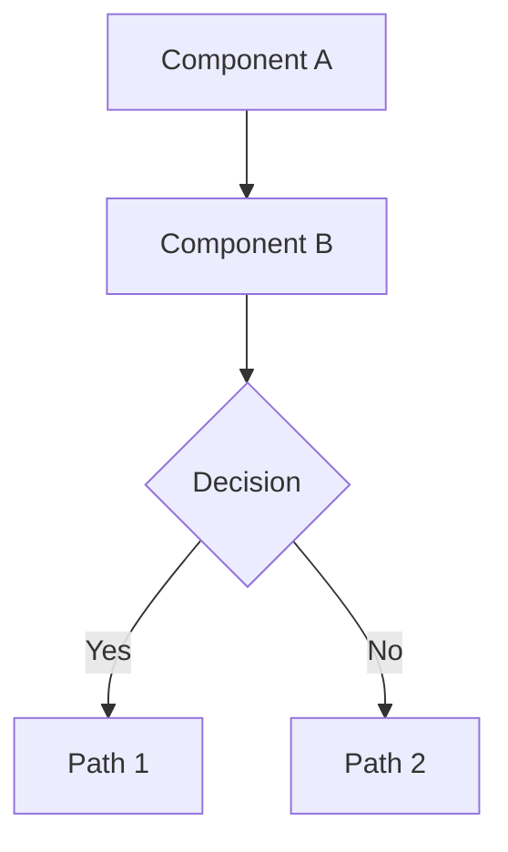

# Research: Architecture Diagrams

**Date**: 2025-12-29  
**Status**: Complete

## Component Inventory

Based on analysis of `crates/evefrontier-lib/src/lib.rs`, ADR 0002, and ADR 0006:

### Rust Crates

| Crate | Type | Description |
|-------|------|-------------|
| `evefrontier-lib` | Library | Core business logic: dataset handling, graph construction, routing |
| `evefrontier-cli` | Binary | CLI wrapper with argument parsing (Clap) and output formatting |
| `evefrontier-lambda-shared` | Library | Shared Lambda infrastructure: tracing, problem details, runtime |
| `evefrontier-lambda-route` | Binary | Lambda handler for route planning endpoint |
| `evefrontier-lambda-scout-gates` | Binary | Lambda handler for gate-connected neighbors |
| `evefrontier-lambda-scout-range` | Binary | Lambda handler for spatial range queries |

### Library Modules (`evefrontier-lib`)

| Module | Responsibility | Key Exports |
|--------|----------------|-------------|
| `github.rs` | Download dataset from GitHub releases | `download_dataset_with_tag`, `DatasetRelease` |
| `dataset.rs` | Path resolution, ensure dataset exists | `ensure_dataset`, `ensure_e6c3_dataset`, `DatasetPaths` |
| `db.rs` | Load SQLite → Starmap | `load_starmap`, `load_starmap_from_connection`, `Starmap` |
| `graph.rs` | Build adjacency graphs | `build_gate_graph`, `build_spatial_graph`, `build_hybrid_graph` |
| `path.rs` | Pathfinding algorithms | `find_route_bfs`, `find_route_dijkstra`, `find_route_a_star` |
| `routing.rs` | High-level route planning | `plan_route`, `RouteRequest`, `RoutePlan` |
| `spatial.rs` | KD-tree spatial index | `SpatialIndex`, `build_spatial_index`, `load_spatial_index` |
| `output.rs` | Output formatting | `RouteSummary`, `RouteStep`, `RouteOutputKind` |
| `error.rs` | Error types | `Error`, `Result` |
| `temperature.rs` | Temperature calculations | Temperature constraint helpers |

### External Dependencies

| System | Role |
|--------|------|
| GitHub Releases (Scetrov/evefrontier_datasets) | Source of SQLite dataset files |
| SQLite (via rusqlite) | Dataset storage format |
| OS Cache Directory | Cached downloads location |
| Spatial Index File (.spatial.bin) | Pre-computed KD-tree for fast spatial queries |

## Mermaid Syntax Research

### Best Practices for GitHub Rendering

1. **Use fenced code blocks** with `mermaid` language identifier
2. **Keep diagrams simple** - GitHub has rendering limits
3. **Use subgraphs** for grouping related nodes
4. **Use meaningful node IDs** for readability
5. **Direction**: `TD` (top-down) for hierarchical, `LR` (left-right) for flow

### Supported Diagram Types

| Type | Syntax | Use Case |
|------|--------|----------|
| Flowchart | `graph TD` / `flowchart TD` | Component relationships, data flow |
| Sequence | `sequenceDiagram` | Time-ordered interactions |
| Class | `classDiagram` | Rust struct relationships (if needed) |

### Example Mermaid Syntax

## Data Flow Analysis

### Download Flow

1. User/Lambda requests dataset via `ensure_dataset()` or `ensure_e6c3_dataset()`
2. `dataset.rs` checks if file exists at resolved path
3. If missing, `github.rs` fetches from GitHub Releases API
4. Asset downloaded to temp file, then atomically renamed
5. Returns `DatasetPaths` with database and optional spatial index paths

### Load Flow

1. `db.rs::load_starmap()` opens SQLite connection
2. Schema detection determines table names (SolarSystems vs mapSolarSystems)
3. Systems and jumps loaded into `Starmap` struct
4. Name-to-ID index built for fuzzy matching

### Route Planning Flow

1. `routing.rs::plan_route()` receives `RouteRequest`
2. Resolves system names to IDs (with fuzzy suggestions on failure)
3. Selects graph type based on algorithm and constraints
4. Builds graph using `graph.rs` builders
5. Calls appropriate pathfinder from `path.rs`
6. Returns `RoutePlan` with step IDs

### Lambda Cold-Start Flow

1. Handler invocation triggers `init_runtime()` if not initialized
2. `include_bytes!` loads bundled database and spatial index
3. `rusqlite::Connection::open_with_flags()` with `SQLITE_OPEN_MEMORY`
4. `load_starmap_from_connection()` builds Starmap
5. `SpatialIndex::load_from_bytes()` decompresses KD-tree
6. Runtime stored in `OnceLock` for reuse

## Diagram Design Decisions

### Decision: Component Overview Layout

**Chosen**: Horizontal (LR) for main flow, with subgraphs for grouping
**Rationale**: Shows data flow from external → library → consumers naturally

### Decision: Module Dependency Direction

**Chosen**: Top-down (TD) showing imports
**Rationale**: Matches typical dependency visualization (high-level at top)

### Decision: Sequence Diagram Participants

**Chosen**: Actors for external (User, AWS), participants for code modules
**Rationale**: Distinguishes human/system actors from code components

### Decision: Color Coding

**Chosen**: No explicit colors (rely on Mermaid defaults)
**Rationale**: Maximum compatibility across renderers, simpler maintenance

## Alternatives Considered

| Alternative | Rejected Because |
|-------------|------------------|
| PlantUML | Requires external rendering service or local install |
| D2 | Not natively supported by GitHub |
| External PNG images | Not version-controllable, requires image hosting |
| Graphviz/DOT | Requires rendering step, not inline in Markdown |

## References

- [Mermaid Documentation](https://mermaid.js.org/intro/)
- [GitHub Mermaid Support](https://github.blog/2022-02-14-include-diagrams-markdown-files-mermaid/)
- [ADR 0002: Workspace Structure](../../docs/adrs/0002-workspace-structure.md)
- [ADR 0006: Software Components](../../docs/adrs/0006-software-components.md)
