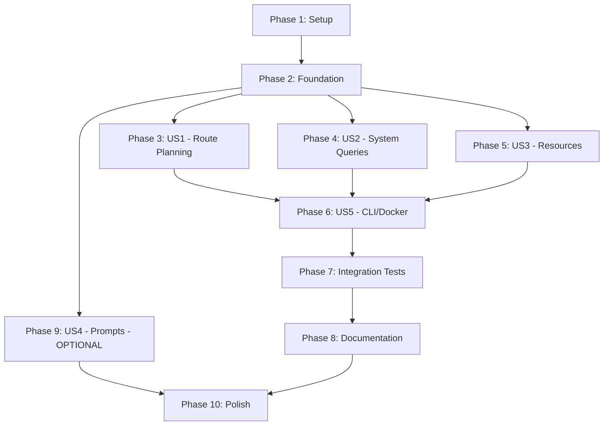

# Tasks: MCP Server Integration

**Input**: Design documents from `/specs/016-mcp-server-integration/`  
**Prerequisites**: plan.md ✓, spec.md ✓, research.md ✓, data-model.md ✓, contracts/ ✓

**Organization**: Tasks are grouped by user story to enable independent implementation and testing of each story.

## Format: `- [ ] [ID] [P?] [Story] Description`

- **[P]**: Can run in parallel (different files, no dependencies)
- **[Story]**: Which user story this task belongs to (e.g., US1, US2)
- Include exact file paths in descriptions

---

## Phase 1: Setup (Shared Infrastructure)

**Purpose**: Project initialization and workspace configuration

- [ ] T001 Create `crates/evefrontier-mcp/` crate directory structure (Cargo.toml, src/, tests/)
- [ ] T002 Add `evefrontier-mcp` to workspace members in root `Cargo.toml`
- [ ] T003 [P] Create `crates/evefrontier-mcp/Cargo.toml` with dependencies (rmcp, tokio, serde, tracing)
- [ ] T004 [P] Create `crates/evefrontier-mcp/project.json` for Nx task orchestration
- [ ] T005 [P] Create `crates/evefrontier-lib/src/mcp/mod.rs` module with public exports
- [ ] T006 Add `schemars` dependency to `crates/evefrontier-lib/Cargo.toml`

---

## Phase 2: Foundational (Blocking Prerequisites)

**Purpose**: Core infrastructure that MUST be complete before ANY user story tool implementation

**⚠️ CRITICAL**: No user story work can begin until this phase is complete

- [ ] T007 Create `McpServerState` struct in `crates/evefrontier-mcp/src/server.rs`
- [ ] T008 Implement `McpServerState::new()` to load starmap and spatial index
- [ ] T009 Create `DatasetInfo` struct in `crates/evefrontier-mcp/src/server.rs`
- [ ] T010 [P] Create error types in `crates/evefrontier-mcp/src/error.rs` (ToolError)
- [ ] T011 [P] Configure tracing to stderr in `crates/evefrontier-mcp/src/main.rs`
- [ ] T012 Implement MCP server initialization handshake in `crates/evefrontier-mcp/src/server.rs`
- [ ] T013 Create ADR 0020 documenting MCP integration decisions in `docs/adrs/0020-mcp-server-integration.md`

**Checkpoint**: Foundation ready - user story tool implementation can now begin in parallel

---

## Phase 3: User Story 1 - Route Planning via AI Assistant (Priority: P1) 🎯 MVP

**Goal**: Enable AI assistants to plan routes between star systems with constraints

**Independent Test**: Configure Claude Desktop with MCP server, ask "Plan a route from Nod to Brana", verify route response

### Implementation for User Story 1

- [ ] T014 [P] [US1] Create `RoutePlanInput` struct in `crates/evefrontier-lib/src/mcp/tools.rs` with JsonSchema derive
- [ ] T015 [P] [US1] Create `RoutePlanOutput` struct in `crates/evefrontier-lib/src/mcp/tools.rs`
- [ ] T016 [P] [US1] Create `RouteDetails` and `Waypoint` structs in `crates/evefrontier-lib/src/mcp/tools.rs`
- [ ] T017 [US1] Implement `route_plan_handler` function in `crates/evefrontier-lib/src/mcp/tools.rs` calling `plan_route`
- [ ] T018 [US1] Add input validation for algorithm names and numeric constraints in route_plan_handler
- [ ] T019 [US1] Add fuzzy matching error handling for unknown system names in route_plan_handler
- [ ] T020 [US1] Register route_plan tool with rmcp server in `crates/evefrontier-mcp/src/server.rs`
- [ ] T021 [US1] Write unit test for route_plan_handler happy path in `crates/evefrontier-lib/tests/mcp_tools.rs`
- [ ] T022 [US1] Write unit test for route_plan_handler with constraints in `crates/evefrontier-lib/tests/mcp_tools.rs`
- [ ] T023 [US1] Write unit test for route_plan_handler unknown system error in `crates/evefrontier-lib/tests/mcp_tools.rs`

**Checkpoint**: Route planning tool fully functional and testable independently

---

## Phase 4: User Story 2 - System Information Queries (Priority: P1)

**Goal**: Enable AI assistants to query detailed system information and spatial searches

**Independent Test**: Query "Tell me about Nod" and verify coordinates, temperature, gates returned

### Implementation for User Story 2 (Part 1: system_info)

- [ ] T024 [P] [US2] Create `SystemInfoInput` struct in `crates/evefrontier-lib/src/mcp/tools.rs`
- [ ] T025 [P] [US2] Create `SystemInfoOutput` and `SystemDetails` structs in `crates/evefrontier-lib/src/mcp/tools.rs`
- [ ] T026 [US2] Implement `system_info_handler` function in `crates/evefrontier-lib/src/mcp/tools.rs`
- [ ] T027 [US2] Add planet/moon counting logic to system_info_handler
- [ ] T028 [US2] Add gate connection extraction to system_info_handler
- [ ] T029 [US2] Register system_info tool with rmcp server in `crates/evefrontier-mcp/src/server.rs`
- [ ] T030 [US2] Write unit test for system_info_handler in `crates/evefrontier-lib/tests/mcp_tools.rs`

### Implementation for User Story 2 (Part 2: systems_nearby)

- [ ] T031 [P] [US2] Create `SystemsNearbyInput` struct in `crates/evefrontier-lib/src/mcp/tools.rs`
- [ ] T032 [P] [US2] Create `SystemsNearbyOutput` and `NearbySystem` structs in `crates/evefrontier-lib/src/mcp/tools.rs`
- [ ] T033 [US2] Implement `systems_nearby_handler` function in `crates/evefrontier-lib/src/mcp/tools.rs`
- [ ] T034 [US2] Add spatial index availability check to systems_nearby_handler
- [ ] T035 [US2] Add temperature filtering to systems_nearby_handler
- [ ] T036 [US2] Add result limiting (max 100) to systems_nearby_handler
- [ ] T037 [US2] Register systems_nearby tool with rmcp server in `crates/evefrontier-mcp/src/server.rs`
- [ ] T038 [US2] Write unit test for systems_nearby_handler in `crates/evefrontier-lib/tests/mcp_tools.rs`

### Implementation for User Story 2 (Part 3: gates_from)

- [ ] T039 [P] [US2] Create `GatesFromInput` struct in `crates/evefrontier-lib/src/mcp/tools.rs`
- [ ] T040 [P] [US2] Create `GatesFromOutput` and `GateConnection` structs in `crates/evefrontier-lib/src/mcp/tools.rs`
- [ ] T041 [US2] Implement `gates_from_handler` function in `crates/evefrontier-lib/src/mcp/tools.rs`
- [ ] T042 [US2] Register gates_from tool with rmcp server in `crates/evefrontier-mcp/src/server.rs`
- [ ] T043 [US2] Write unit test for gates_from_handler in `crates/evefrontier-lib/tests/mcp_tools.rs`

**Checkpoint**: All system query tools (system_info, systems_nearby, gates_from) functional independently

---

## Phase 5: User Story 3 - Dataset Resource Access (Priority: P2)

**Goal**: Expose dataset metadata as MCP resources for advanced users

**Independent Test**: Request `resources/list` and verify 3 resources returned, request `evefrontier://dataset/info` and verify system count

### Implementation for User Story 3

- [ ] T044 [P] [US3] Create resource handler functions in `crates/evefrontier-lib/src/mcp/resources.rs`
- [ ] T045 [P] [US3] Implement `dataset_info_resource` returning JSON with system/gate counts
- [ ] T046 [P] [US3] Implement `algorithms_resource` returning JSON with algorithm descriptions
- [ ] T047 [P] [US3] Implement `spatial_index_status_resource` returning JSON with index metadata
- [ ] T048 [US3] Register all 3 resources with rmcp server in `crates/evefrontier-mcp/src/server.rs`
- [ ] T049 [US3] Write unit test for dataset_info_resource in `crates/evefrontier-lib/tests/mcp_resources.rs`
- [ ] T050 [US3] Write unit test for algorithms_resource in `crates/evefrontier-lib/tests/mcp_resources.rs`
- [ ] T051 [US3] Write unit test for spatial_index_status_resource in `crates/evefrontier-lib/tests/mcp_resources.rs`

**Checkpoint**: All resources accessible via MCP protocol

---

## Phase 6: User Story 5 - CLI Integration & Container Deployment (Priority: P2)

**Goal**: Make MCP server accessible via CLI and containerized

**Independent Test**: Run `evefrontier-cli mcp` and verify stdio transport initializes

### Implementation for User Story 5 (Part 1: CLI)

- [ ] T052 [P] [US5] Create `crates/evefrontier-cli/src/commands/mcp.rs` with McpArgs struct
- [ ] T053 [US5] Implement `run_mcp_server` function calling library initialization
- [ ] T054 [US5] Add `mcp` subcommand to CLI parser in `crates/evefrontier-cli/src/main.rs`
- [ ] T055 [US5] Add `--data-dir` flag support to mcp subcommand
- [ ] T056 [US5] Write integration test for CLI mcp subcommand in `crates/evefrontier-cli/tests/mcp_test.rs`

### Implementation for User Story 5 (Part 2: Docker)

- [ ] T057 [P] [US5] Create `crates/evefrontier-mcp/Dockerfile` with multi-stage build
- [ ] T058 [US5] Configure Dockerfile to use Distroless base image with non-root user
- [ ] T059 [US5] Add `CAP_DROP=all` security configuration to Dockerfile
- [ ] T060 [US5] Bundle dataset and spatial index in Docker image
- [ ] T061 [US5] Write Docker build and run instructions in `docs/MCP_SERVER.md`
- [ ] T062 [US5] Test Docker image with `docker run -i` and verify stdio transport works

**Checkpoint**: MCP server accessible via CLI and Docker

---

## Phase 7: Integration Testing & Protocol Compliance

**Purpose**: Verify end-to-end MCP protocol compliance

- [ ] T063 [P] Write stdio transport integration test in `crates/evefrontier-mcp/tests/integration_test.rs`
- [ ] T064 [P] Write initialization handshake test in `crates/evefrontier-mcp/tests/integration_test.rs`
- [ ] T065 Test tools/list request returns 4 tools in `crates/evefrontier-mcp/tests/integration_test.rs`
- [ ] T066 Test resources/list request returns 3 resources in `crates/evefrontier-mcp/tests/integration_test.rs`
- [ ] T067 Test tool execution with JSON-RPC 2.0 format in `crates/evefrontier-mcp/tests/integration_test.rs`
- [ ] T068 Test error responses follow RFC 9457 format in `crates/evefrontier-mcp/tests/integration_test.rs`

---

## Phase 8: Documentation & Configuration Examples

**Purpose**: Provide user-facing documentation and AI client configurations

- [ ] T069 [P] Create `docs/MCP_SERVER.md` with architecture overview
- [ ] T070 [P] Document tool schemas and parameters in `docs/MCP_SERVER.md`
- [ ] T071 [P] Add Claude Desktop configuration example to `docs/MCP_SERVER.md`
- [ ] T072 [P] Add VS Code GitHub Copilot configuration example to `docs/MCP_SERVER.md`
- [ ] T073 [P] Add Cursor configuration example to `docs/MCP_SERVER.md`
- [ ] T074 [P] Add troubleshooting section to `docs/MCP_SERVER.md`
- [ ] T075 Update `README.md` with MCP server usage section
- [ ] T076 Update `docs/TODO.md` marking MCP server integration tasks complete

---

## Phase 9: User Story 4 - Prompt Templates (Priority: P3) [OPTIONAL]

**Goal**: Provide pre-built prompt templates for common queries

**Independent Test**: Request `prompts/list` and verify templates returned

**Note**: This phase is OPTIONAL and can be deferred to v2

- [ ] T077 [P] [US4] Create prompt definitions in `crates/evefrontier-lib/src/mcp/prompts.rs`
- [ ] T078 [P] [US4] Implement `route_planning_prompt` template
- [ ] T079 [P] [US4] Implement `system_exploration_prompt` template
- [ ] T080 [US4] Register prompts with rmcp server in `crates/evefrontier-mcp/src/server.rs`
- [ ] T081 [US4] Write unit test for prompt templates in `crates/evefrontier-lib/tests/mcp_prompts.rs`

---

## Phase 10: Polish & Cross-Cutting Concerns

**Purpose**: Final polish, performance validation, security audit

- [ ] T082 Run `cargo fmt` on all modified files
- [ ] T083 Run `cargo clippy --workspace --all-targets` and fix all warnings
- [ ] T084 Run `cargo test --workspace` and verify all tests pass
- [ ] T085 Run `cargo audit` and resolve any security advisories
- [ ] T086 Measure cold-start time and verify <5s (NFR-001)
- [ ] T087 Measure tool execution latency and verify <500ms p95 (NFR-002)
- [ ] T088 Measure memory usage and verify <512MB (NFR-003)
- [ ] T089 Test with mcp-inspector to verify protocol compliance
- [ ] T090 Test with Claude Desktop end-to-end
- [ ] T091 Run Docker security scan with Trivy
- [ ] T092 Update `CHANGELOG.md` with MCP server integration entry

---

## Dependencies Between User Stories

## Parallel Execution Opportunities

### After Foundation (Phase 2) Complete:
- **Parallel Group 1**: T014-T023 (US1 route planning), T024-T043 (US2 system queries), T044-T051 (US3 resources)
- All three user stories can be implemented simultaneously by different developers

### After User Stories Complete:
- **Parallel Group 2**: T052-T056 (CLI integration), T057-T062 (Docker), T063-T068 (integration tests), T069-T076 (docs)

### During Polish Phase:
- **Parallel Group 3**: All Phase 10 tasks can run concurrently except T092 (CHANGELOG)

## Implementation Strategy

### MVP Scope (Minimum Viable Product)
Implement **ONLY** these phases for v1.0:
- Phase 1: Setup
- Phase 2: Foundation
- Phase 3: US1 (Route Planning) - P1
- Phase 4: US2 (System Queries) - P1
- Phase 6: US5 (CLI Integration only, defer Docker)
- Phase 7: Integration Tests
- Phase 8: Documentation
- Phase 10: Polish

**Defer to v1.1+**:
- Phase 5: US3 (Resources) - P2
- Phase 6: US5 (Docker) - P2
- Phase 9: US4 (Prompts) - P3

### Estimated Task Distribution
- **Setup/Foundation**: 13 tasks (~10% of work)
- **User Story 1 (Route Planning)**: 10 tasks (~15% of work)
- **User Story 2 (System Queries)**: 20 tasks (~25% of work)
- **User Story 3 (Resources)**: 8 tasks (~10% of work)
- **User Story 5 (CLI/Docker)**: 11 tasks (~15% of work)
- **Integration & Testing**: 6 tasks (~10% of work)
- **Documentation**: 8 tasks (~10% of work)
- **Polish**: 11 tasks (~15% of work)

**Total**: 92 tasks (87 required for MVP, 5 optional for prompts)

## Success Metrics Validation

Map tasks to success criteria from spec.md:

| Success Criterion | Validating Tasks |
|-------------------|------------------|
| SC-001: Initialize with Claude Desktop | T012, T063, T064, T090 |
| SC-002: All 4 tools pass integration tests | T021-T023, T030, T038, T043, T065, T067 |
| SC-003: Docker security scan passes | T091 (Docker deferred to v1.1) |
| SC-004: Response times <500ms p95 | T087 |
| SC-005: Configuration examples | T071-T073 |
