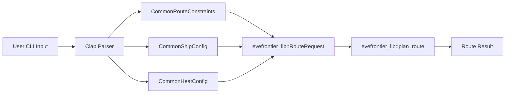

# Data Model: Shared Argument Structs

**Feature**: 027-route-scout-parameter-parity  
**Phase**: 1 (Design)  
**Date**: 2026-02-03

## Overview

This document defines the data model for shared CLI argument structs that will be used across `route` and `scout` commands to ensure parameter parity.

### Design Principles
1. **Single Responsibility**: Each struct handles one concern (routing, ship, heat)
2. **Immutable Defaults**: Default values match existing CLI behavior (backward compatible)
3. **Type Safety**: Use Rust type system to enforce invariants (e.g., `Option<f64>` for optional parameters)
4. **Help Text Clarity**: All parameters grouped under logical help headings

---

## Entity: CommonRouteConstraints

### Purpose
Encapsulates routing constraints that apply to pathfinding algorithms. Used by both `route` and `scout range` commands to filter/avoid systems during path planning.

### Schema

```rust
/// Shared routing constraints for pathfinding operations.
///
/// These constraints are used by both `route` and `scout range` commands
/// to control which systems and jump types are considered during path planning.
///
/// # Examples
///
/// ```rust
/// let constraints = CommonRouteConstraints {
///     max_jump: Some(50.0),
///     avoid: vec!["Brana".to_string(), "H:2L2S".to_string()],
///     avoid_gates: false,
///     max_temp: Some(8000.0),
/// };
/// ```
#[derive(Args, Debug, Clone, Default)]
pub struct CommonRouteConstraints {
    /// Maximum jump distance in light-years.
    ///
    /// When specified, systems beyond this distance cannot be reached via spatial jumps.
    /// Gate jumps are unaffected by this constraint.
    #[arg(long = "max-jump", help_heading = "ROUTING CONSTRAINTS")]
    pub max_jump: Option<f64>,
    
    /// Systems to avoid when building the path.
    ///
    /// Repeat this flag for multiple systems. The pathfinding algorithm will exclude
    /// these systems from all routes (both gate and spatial jumps).
    ///
    /// # Example
    ///
    /// ```bash
    /// evefrontier-cli route --from Nod --to Brana --avoid "H:2L2S" --avoid "G:3OA0"
    /// ```
    #[arg(long = "avoid", help_heading = "ROUTING CONSTRAINTS")]
    pub avoid: Vec<String>,
    
    /// Avoid gates entirely (prefer spatial or traversal routes).
    ///
    /// When enabled, the pathfinding algorithm will only consider spatial jumps
    /// and traversal (warp drive) between systems. This is useful for finding
    /// routes through uncharted space or avoiding gate travel fees.
    #[arg(long = "avoid-gates", action = ArgAction::SetTrue, help_heading = "ROUTING CONSTRAINTS")]
    pub avoid_gates: bool,
    
    /// Maximum system temperature threshold in Kelvin.
    ///
    /// Only applies to spatial jumps - systems with star temperature above this
    /// threshold cannot be reached via spatial jumps (ships would overheat).
    /// Gate jumps are unaffected by temperature.
    ///
    /// # Typical Values
    ///
    /// - 5000K: Cool red dwarfs only
    /// - 8000K: Most player-accessible systems
    /// - 10000K: Includes some hot white/blue stars
    #[arg(long = "max-temp", help_heading = "ROUTING CONSTRAINTS")]
    pub max_temp: Option<f64>,
}
```

### Validation Rules

| Field | Type | Validation | Default | Error Behavior |
|-------|------|------------|---------|----------------|
| `max_jump` | `Option<f64>` | Must be positive if specified | `None` (unrestricted) | User-facing error if negative |
| `avoid` | `Vec<String>` | No duplicates (deduplicated at runtime) | `[]` (empty) | Fuzzy suggestion if system not found |
| `avoid_gates` | `bool` | N/A (boolean flag) | `false` | N/A |
| `max_temp` | `Option<f64>` | Must be positive if specified | `None` (unrestricted) | User-facing error if negative |

### State Transitions

**N/A** — This is a stateless configuration struct. No runtime state changes.

### Relationships

- **Used by**: `RouteCommandArgs`, `ScoutRangeArgs`
- **Passed to**: `evefrontier_lib::RouteConstraints` (library struct)
- **Dependencies**: None (primitive types only)

---

## Entity: CommonShipConfig

### Purpose
Encapsulates ship and fuel configuration for fuel projection calculations. Used when users want to estimate fuel consumption for planned routes.

### Schema

```rust
/// Shared ship and fuel configuration for fuel projection.
///
/// These parameters control how fuel consumption is calculated during route planning.
/// Fuel projections require a valid ship name from the ship catalog (`ship_data.csv`).
///
/// # Examples
///
/// ```rust
/// let ship_config = CommonShipConfig {
///     ship: Some("Reflex".to_string()),
///     fuel_quality: 50.0,
///     cargo_mass: 1000.0,
///     fuel_load: Some(500.0),
///     dynamic_mass: true,
/// };
/// ```
#[derive(Args, Debug, Clone)]
pub struct CommonShipConfig {
    /// Ship name for fuel projection (case-insensitive).
    ///
    /// When specified, the route planner will calculate fuel consumption for each hop
    /// based on the ship's mass, fuel capacity, and cargo. Use `evefrontier-cli ships`
    /// to list available ships.
    ///
    /// # Example
    ///
    /// ```bash
    /// evefrontier-cli route --from Nod --to Brana --ship Reflex
    /// ```
    #[arg(long = "ship", help_heading = "SHIP & FUEL")]
    pub ship: Option<String>,
    
    /// Fuel quality rating (1-100). Higher quality = more efficient jumps.
    ///
    /// Fuel quality directly affects fuel consumption. Higher quality fuel reduces
    /// the amount burned per light-year. Default is 10 (standard fuel).
    ///
    /// # Formula
    ///
    /// `fuel_cost = (total_mass_kg / 100000) * (fuel_quality / 100) * distance_ly`
    #[arg(long = "fuel-quality", default_value = "10", value_parser = parse_fuel_quality, help_heading = "SHIP & FUEL")]
    pub fuel_quality: f64,
    
    /// Cargo mass in kilograms.
    ///
    /// Added to the ship's hull mass and fuel mass to calculate total mass for
    /// fuel consumption. Default is 0 (empty cargo hold).
    #[arg(long = "cargo-mass", default_value = "0", value_parser = parse_non_negative, help_heading = "SHIP & FUEL")]
    pub cargo_mass: f64,
    
    /// Initial fuel load in units. Defaults to full capacity.
    ///
    /// When specified, the route planner starts with this fuel amount instead of
    /// the ship's maximum capacity. Useful for planning routes with partial fuel loads.
    #[arg(long = "fuel-load", value_parser = parse_non_negative, help_heading = "SHIP & FUEL")]
    pub fuel_load: Option<f64>,
    
    /// Recalculate mass after each hop as fuel is consumed.
    ///
    /// When enabled (dynamic mass mode), the route planner recalculates fuel consumption
    /// for each hop based on the remaining fuel. This produces more accurate projections
    /// for long routes but increases computation time.
    ///
    /// When disabled (static mass mode), fuel consumption is calculated once using the
    /// initial mass (hull + cargo + full fuel load).
    #[arg(long = "dynamic-mass", action = ArgAction::SetTrue, help_heading = "SHIP & FUEL")]
    pub dynamic_mass: bool,
}
```

### Validation Rules

| Field | Type | Validation | Default | Error Behavior |
|-------|------|------------|---------|----------------|
| `ship` | `Option<String>` | Must exist in `ShipCatalog` if specified | `None` | Fuzzy suggestion if ship not found |
| `fuel_quality` | `f64` | Range 1.0-100.0 (enforced by `parse_fuel_quality`) | `10.0` | User-facing error if out of range |
| `cargo_mass` | `f64` | Non-negative (enforced by `parse_non_negative`) | `0.0` | User-facing error if negative |
| `fuel_load` | `Option<f64>` | Non-negative (enforced by `parse_non_negative`) | `None` (full capacity) | User-facing error if negative |
| `dynamic_mass` | `bool` | N/A (boolean flag) | `false` | N/A |

### State Transitions

**N/A** — Configuration struct. Actual fuel state tracking happens in `evefrontier_lib::ship::ShipLoadout`.

### Relationships

- **Used by**: `RouteCommandArgs`, `ScoutRangeArgs`
- **Passed to**: `evefrontier_lib::ShipLoadout` and `evefrontier_lib::FuelConfig`
- **Dependencies**: `parse_fuel_quality`, `parse_non_negative` (value parser functions)

---

## Entity: CommonHeatConfig

### Purpose
Encapsulates heat mechanics configuration for temperature-aware routing. Controls whether the pathfinding algorithm rejects jumps that would overheat the ship.

### Schema

```rust
/// Shared heat mechanics configuration for temperature-aware routing.
///
/// Heat mechanics model how ships accumulate thermal stress during spatial jumps
/// through high-temperature systems. When `avoid_critical_state` is enabled,
/// the pathfinding algorithm rejects jumps that would bring the ship to critical
/// temperature (≥150K hull temperature).
///
/// # Examples
///
/// ```rust
/// let heat_config = CommonHeatConfig {
///     avoid_critical_state: true,
///     no_avoid_critical_state: false,
///     sys_temp_curve: TemperatureCurveArg::Flux,
/// };
/// ```
#[derive(Args, Debug, Clone)]
pub struct CommonHeatConfig {
    /// Heat-aware routing enabled by default (uses Reflex if --ship not specified);
    /// rejects jumps reaching critical temperature (≥150K).
    ///
    /// When enabled, the pathfinding algorithm simulates hull temperature changes
    /// during spatial jumps and rejects any jump that would bring the ship to
    /// critical temperature. This prevents catastrophic overheating.
    ///
    /// # Example
    ///
    /// ```bash
    /// evefrontier-cli route --from Nod --to Brana --avoid-critical-state
    /// ```
    #[arg(long = "avoid-critical-state", action = ArgAction::SetTrue, help_heading = "HEAT MECHANICS")]
    pub avoid_critical_state: bool,
    
    /// Disable temperature constraints for gate-only networks or intentional high-risk planning.
    ///
    /// When enabled, this flag overrides `avoid_critical_state` and allows the pathfinding
    /// algorithm to consider all spatial jumps regardless of heat risk. Use with caution.
    #[arg(long = "no-avoid-critical-state", action = ArgAction::SetTrue, help_heading = "HEAT MECHANICS")]
    pub no_avoid_critical_state: bool,
    
    /// Temperature calculation model: 'flux' (default, flux-based inverse-tangent)
    /// or 'logistic' (empirical sigmoid). Both models validated at ~1.2K MAE.
    ///
    /// The temperature model affects how system temperature is calculated from
    /// stellar flux and distance. Both models are validated against in-game data.
    ///
    /// - **flux**: Physically interpretable inverse-tangent model (default)
    /// - **logistic**: Empirical sigmoid model (alternative)
    ///
    /// # Example
    ///
    /// ```bash
    /// evefrontier-cli route --from Nod --to Brana --sys-temp-curve logistic
    /// ```
    #[arg(long = "sys-temp-curve", value_enum, default_value_t = TemperatureCurveArg::default(), help_heading = "HEAT MECHANICS")]
    pub sys_temp_curve: TemperatureCurveArg,
}
```

### Validation Rules

| Field | Type | Validation | Default | Error Behavior |
|-------|------|------------|---------|----------------|
| `avoid_critical_state` | `bool` | N/A | `false` | N/A |
| `no_avoid_critical_state` | `bool` | Mutual exclusion with `avoid_critical_state` | `false` | Takes precedence if both true |
| `sys_temp_curve` | `TemperatureCurveArg` | Enum (Flux or Logistic) | `Flux` | N/A (type-safe) |

### State Transitions

**Mutual Exclusion Logic**:
```rust
impl CommonHeatConfig {
    /// Resolve the final heat constraint state.
    ///
    /// If both `avoid_critical_state` and `no_avoid_critical_state` are true,
    /// `no_avoid_critical_state` takes precedence (explicit disable wins).
    pub fn should_avoid_critical_state(&self) -> bool {
        if self.no_avoid_critical_state {
            false  // Explicit disable overrides enable
        } else {
            self.avoid_critical_state
        }
    }
}
```

### Relationships

- **Used by**: `RouteCommandArgs`, `ScoutRangeArgs`
- **Passed to**: `evefrontier_lib::HeatConfig` and `evefrontier_lib::RouteConstraints`
- **Dependencies**: `TemperatureCurveArg` enum (already exists in `main.rs`)

---

## Cross-Entity Relationships

### Composition in RouteCommandArgs

```rust
#[derive(Args, Debug, Clone)]
struct RouteCommandArgs {
    #[command(flatten)]
    endpoints: RouteEndpoints,
    
    #[command(flatten)]
    constraints: CommonRouteConstraints,
    
    #[command(flatten)]
    ship: CommonShipConfig,
    
    #[command(flatten)]
    heat: CommonHeatConfig,
    
    // ... route-specific flags
}
```

### Composition in ScoutRangeArgs

```rust
#[derive(Args, Debug, Clone)]
pub struct ScoutRangeArgs {
    pub system: String,
    
    #[command(flatten)]
    constraints: CommonRouteConstraints,
    
    #[command(flatten)]
    ship: CommonShipConfig,
    
    #[command(flatten)]
    heat: CommonHeatConfig,
    
    // ... scout-specific flags
}
```

### Conversion to Library Types

```rust
impl From<CommonRouteConstraints> for evefrontier_lib::RouteConstraints {
    fn from(cli: CommonRouteConstraints) -> Self {
        Self {
            max_jump: cli.max_jump,
            avoid_systems: cli.avoid,
            avoid_gates: cli.avoid_gates,
            max_temperature: cli.max_temp,
            // ... other fields populated from other sources
        }
    }
}
```

---

## Data Flow



---

## Summary

### Entities Defined
1. **CommonRouteConstraints** — Routing constraints (max jump, avoidance, temperature)
2. **CommonShipConfig** — Ship and fuel configuration (ship name, fuel quality, cargo, dynamic mass)
3. **CommonHeatConfig** — Heat mechanics configuration (critical state avoidance, temperature model)

### Key Design Decisions
- ✅ Structs use `Default` trait for zero-cost instantiation
- ✅ Help headings group related parameters in help output
- ✅ Value parsers enforce invariants at parse time (fail fast)
- ✅ Mutual exclusion logic documented in Rustdoc comments

### Next Steps
1. Implement shared structs in `crates/evefrontier-cli/src/common_args.rs`
2. Update `RouteCommandArgs` and `ScoutRangeArgs` to use `#[command(flatten)]`
3. Write conversion functions to library types
4. Add CLI integration tests verifying parameter parity
